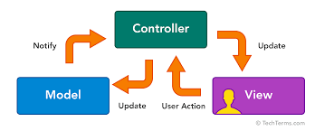

 
Le modèle MVC décrit une manière d’architecturer une application informatique en la décomposant en trois sous-parties :
Modèle : cette partie gère les données de notre site. Son rôle est d'aller récupérer les informations « brutes » dans la base de données, de les organiser et de les assembler pour qu'elles puissent ensuite être traitées par le contrôleur. On y trouve donc nos  requêtes SQL par exemple.
La partie Vue se concentre sur l'affichage. Elle ne fait presque aucun calcul , elle  se contente de récupérer des variables pour savoir ce qu'elle doit afficher. On y trouve essentiellement du code HTML et les boucle foreach pour l’affichage des variables en PHP .
Contrôleur : cette partie gère la logique du code qui prend des décisions. C'est en quelque sorte l'intermédiaire entre le modèle et la vue . le contrôleur va demander au modèle les données, les analyser, prendre des décisions et renvoyer le texte à afficher à la vue. Le contrôleur contient exclusivement du PHP. C'est notamment lui qui détermine si le visiteur a le droit de voir la page ou non pour la  gestion  des droits d'accès.
 
 
 Le modèle MVC décrit une manière d’architecturer une application informatique en la décomposant en trois sous-parties :
 Modèle : cette partie gère les données de notre site. Son rôle est d'aller récupérer les informations « brutes » dans la base de données, de les organiser et de les assembler pour qu'elles puissent ensuite être traitées par le contrôleur. On y trouve donc nos  requêtes SQL par exemple.
 La partie Vue se concentre sur l'affichage. Elle ne fait presque aucun calcul , elle  se contente de récupérer des variables pour savoir ce qu'elle doit afficher. On y trouve essentiellement du code HTML et les boucle foreach pour l’affichage des variables en PHP .
 Contrôleur : cette partie gère la logique du code qui prend des décisions. C'est en quelque sorte l'intermédiaire entre le modèle et la vue . le contrôleur va demander au modèle les données, les analyser, prendre des décisions et renvoyer le texte à afficher à la vue. Le contrôleur contient exclusivement du PHP. C'est notamment lui qui détermine si le visiteur a le droit de voir la page ou non pour la  gestion  des droits d'accès.
 
 
